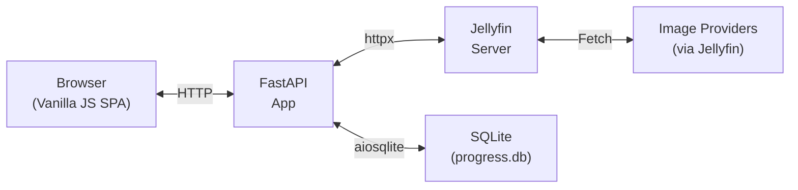
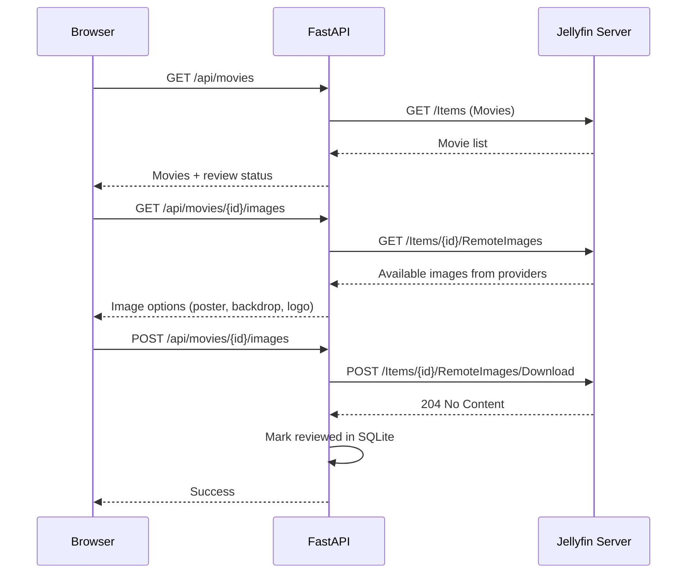

# Jellyfin Posters

A keyboard-driven web UI for reviewing and applying movie posters, backdrops, and logos to your [Jellyfin](https://jellyfin.org) media server.


## Features

- Browse your Jellyfin movie library in a sidebar with search
- View current vs. available images side-by-side (posters, backdrops, logos)
- Apply new artwork to Jellyfin with one click or keypress
- Track review progress with persistent SQLite storage
- Export/import progress data across instances
- Clean up duplicate backdrops
- Fully keyboard-navigable workflow

## Architecture



## Quick Start (Docker Compose)

1. Create a `.env` file:

   ```env
   JELLYFIN_URL=http://your-jellyfin-server:8096
   ```

2. Start the container:

   ```yaml
   # docker-compose.yml
   services:
     jellyfin-posters:
       image: ghcr.io/imgkl/jellyfin-posters:latest
       container_name: jellyfin-posters
       ports:
         - "8000:8000"
       volumes:
         - poster_data:/data
       env_file:
         - .env
       environment:
         - DB_PATH=/data/progress.db
       restart: unless-stopped

   volumes:
     poster_data:
   ```

   ```bash
   docker compose up -d
   ```

3. Open [http://localhost:8000](http://localhost:8000) and log in with your Jellyfin credentials.

## Configuration

All configuration is via environment variables (or a `.env` file):

| Variable | Default | Description |
|---|---|---|
| `JELLYFIN_URL` | `http://localhost:8096` | Jellyfin server URL (no trailing slash) |
| `JELLYFIN_USERNAME` | *(empty)* | Optional: pre-fill the login username |
| `JELLYFIN_PASSWORD` | *(empty)* | Optional: pre-fill the login password |
| `DB_PATH` | `/data/progress.db` | Path to the SQLite progress database |
| `HOST` | `0.0.0.0` | Server bind address |
| `PORT` | `8000` | Server port |

## Local Development

```bash
# Clone and enter the project
cd jellyfin_posters

# Create a virtual environment
python3 -m venv venv
source venv/bin/activate

# Install dependencies
pip install -r requirements.txt

# Configure
cp .env.example .env
# Edit .env with your Jellyfin server URL

# Run
uvicorn app.main:app --reload
```

The app will be available at [http://localhost:8000](http://localhost:8000).

## Keyboard Shortcuts

| Key | Action |
|---|---|
| `Space` | Fullscreen preview of selected image |
| `Escape` | Close preview / settings modal |
| `Arrow Up` | Previous movie |
| `Arrow Down` | Next movie |
| `Enter` | Apply selected images and move to next |
| `S` | Skip current movie |
| `/` | Focus search input |

Shortcuts are disabled while typing in input fields or when a modal is open.

## API Overview

All endpoints are under `/api/`. The core image-apply flow:



**Route groups:**

| Prefix | Purpose |
|---|---|
| `/api/auth` | Login, logout, auth status |
| `/api/movies` | List movies, get details, manage images |
| `/api/library` | Refresh library, cleanup backdrops, prefetch |
| `/api/progress` | Review statistics |
| `/api/data` | Export/import progress data |

## Tech Stack

| Layer | Technology |
|---|---|
| Backend | [FastAPI](https://fastapi.tiangolo.com) + [Uvicorn](https://www.uvicorn.org) |
| HTTP Client | [httpx](https://www.python-httpx.org) (async) |
| Database | [SQLite](https://sqlite.org) via [aiosqlite](https://github.com/omnilib/aiosqlite) |
| Config | [pydantic-settings](https://docs.pydantic.dev/latest/concepts/pydantic_settings/) |
| Frontend | Vanilla JavaScript (ES6+ classes), HTML, CSS |
| Container | Docker (Python 3.12-slim), multi-arch (amd64/arm64) |
| CI/CD | GitHub Actions &rarr; GHCR |

## License

*License not yet specified.*
